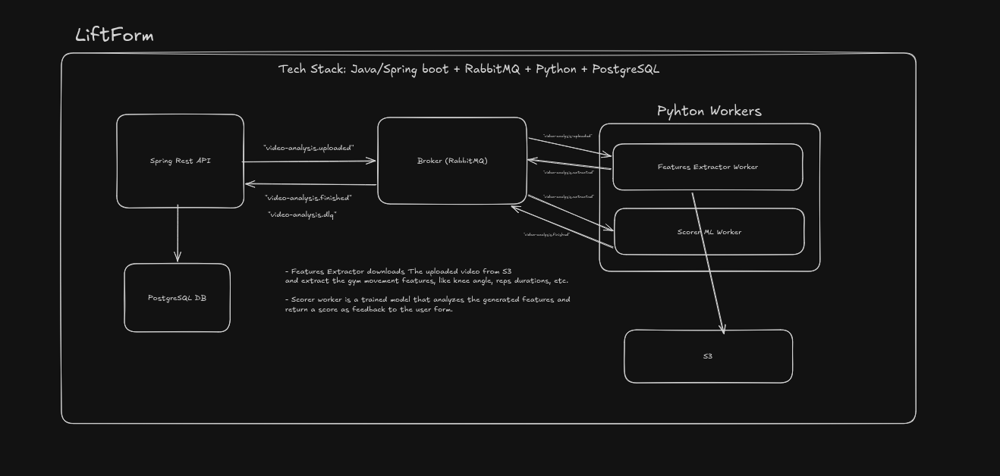

# Liftform

Liftform is a gym-movement analyzer. A user uploads a video of a lift (currently only **squats**); the video is
processed by a computer-vision pipeline to extract rep-level pose features, which are then scored for form quality
and turned into actionable feedback.

The system is a polyglot monorepo made of independent services that communicate over **RabbitMQ** (events) and
**S3-compatible object storage** (video files), so each part can be deployed, scaled, and iterated on independently.

## System Overall Architecture



## Services

### `api/liftform` — REST API

Java 21 / Spring Boot 4. The source of truth for users, auth, and video-analysis records. Owns the Postgres database
and is the only service that talks to clients directly.

- Issues presigned S3 upload URLs so videos go straight from the client to object storage (never through the API).
- Tracks the lifecycle of a video analysis (`CREATED → UPLOADED → PROCESSING → COMPLETED`, or `FAILED`/`EXPIRED`).
- Publishes a `VideoAnalysisUploaded` event to RabbitMQ once a client confirms an upload, which is what kicks off
  processing on the worker side.
- Also the other end of the pipeline: consumes the score analyzer worker's result event and both workers' error
  events, persisting the outcome and completing the lifecycle — see the "Video analysis lifecycle & messaging"
  section in [`CLAUDE.md`](CLAUDE.md) for the full request/event flow.
- Stateless JWT auth, with refresh tokens stored hashed in Postgres.
- Built with hexagonal / Clean Architecture — see [Architecture](#architecture) below.

### `workers/pose-feature-extractor-worker` — pose extraction worker

Python. Consumes `VideoAnalysisUploaded` events off RabbitMQ, downloads the video from S3, and runs MediaPipe pose
estimation over it to extract rep-level features (angles, tempo, depth, smoothness, etc. per rep).

- Rep detection is a hysteresis state machine over the knee-angle signal, with the raw signal smoothed
  (Savitzky-Golay) before detection to reduce landmark noise.
- On success, publishes a "features extracted" event that triggers the score analyzer worker — this is the link
  between the two Python workers.
- Failed messages are retried up to 3 times with exponential backoff, then the worker itself publishes a
  structured error payload to a dead-letter queue (rather than relying on a bare `nack`), so the API can turn it
  into a queryable error record instead of just an opaque dropped message.
- This is the service expected to carry the most load (video download + CV inference per message), so it's built to
  be horizontally scaled — see [Scaling](#scaling) below.

### `workers/score-analyzer-worker` — score analyzer worker

Python. Consumes the extractor worker's "features extracted" event off RabbitMQ, scores the feature dict with a
pre-trained model, producing a 0–1 form score, a qualitative label, and rule-based per-dimension feedback (depth,
back angle, tempo, lockout, range of motion, consistency), then publishes the result for the API to persist.

- Same retry/DLQ shape as the extractor worker (3 retries with exponential backoff, then an explicit structured
  error published to its own dedicated dead-letter queue) — see [Key design decisions](#key-design-decisions).
- Deliberately doesn't compute the final `GOOD`/`FAIR`/`POOR` classification itself — it publishes the raw score
  and lets the API derive that from a single, domain-owned rule (see below).
- Never touches S3 — the message it consumes already carries the extracted feature dict, no video download needed.

### `frontend/` — web app

React 19 + TypeScript SPA built with Vite, styled with Tailwind CSS v4 + shadcn/ui, routed with React Router.
Ships the public landing page, sign-up and sign-in forms (`react-hook-form` + `zod`) wired to the register/login
APIs, and a protected `/overview` area that a successful sign-up/sign-in redirects into; the upload flow comes
next.

- Deliberately a plain SPA rather than Next.js: the Spring API already owns auth and business logic, and the
  refresh token is an httpOnly `SameSite=Strict` cookie designed for a browser client hitting the API directly.
- The Vite dev server proxies `/api` to `http://localhost:8080`, so the app and API share an origin in
  development (required for the refresh cookie).
- API calls are isolated behind a small `src/lib/api/httpClient.ts` fetch wrapper, with feature code (starting with
  `src/features/auth/`) calling that instead of `fetch` directly — see [`CLAUDE.md`](.claude/CLAUDE.md) for the
  full frontend structure/auth notes.
- Session handling: a bootstrap `POST /auth/refresh` on load (so a hard reload doesn't drop a logged-in session), a
  jittered proactive refresh timer scheduled ahead of access-token expiry, and a reactive refresh-and-retry-once on
  any authenticated request that 401s — see `docs/adr/0001-no-csrf-token-for-refresh-cookie.md` and
  `docs/adr/0002-refresh-jitter-fail-soft.md` for the reasoning behind the trade-offs involved.

## API Architecture

The API follows **Clean Architecture** with some **DDD** principles, structured so that the domain and business
rules never depend on frameworks or infrastructure:

- **`core/domain`** — framework-free domain model. `VideoAnalysis` is a rich domain object (not an anemic
  DTO/entity): it's created via named factory methods (`initialize`, `reconstitute`) and its own state transitions
  are validated internally, rather than left to callers to get right. It's also the sole aggregate root for its
  results and errors — `AnalysisResult`/`PipelineError` are only ever persisted by saving the `VideoAnalysis` they
  belong to (JPA cascade does the rest), not through separate repositories, keeping the aggregate boundary real
  rather than just conceptual.
- **`core/gateway`** — interfaces (ports) the domain/use-case layer depends on for persistence, storage, eventing,
  and security. No Spring, JPA, or AMQP types leak into this layer.
- **`core/usecases`** — one use case per folder, each a plain class with constructor-injected gateways and zero
  Spring annotations, which keeps business logic unit-testable with plain mocks instead of a Spring context.
- **`infraestructure/adapter`** — concrete implementations of the gateway interfaces (JPA repositories, RabbitMQ
  publisher, S3 storage, JWT/password hashing) plus a decorator layer that wraps use cases with `@Transactional`
  boundaries, so transaction management stays out of the framework-free use case classes.
- **`presentation`** — controllers, request/response DTOs, mappers, and centralized exception-to-HTTP translation.

The payoff of this split: business rules (how a video analysis moves through its lifecycle, what counts as a valid
transition) are testable and reviewable without spinning up Spring, a database, or a broker, and infrastructure
(swap Postgres, swap RabbitMQ, swap S3 for something else) can change without touching domain logic.

## Key design decisions

**Why RabbitMQ.** Chosen partly to learn it, but it's also a deliberate fit for this pipeline: we want direct
control over queue topology, retry/backoff behavior, and dead-lettering, rather than relying on a managed
pub/sub abstraction that hides those knobs. All three services declare their own corner of a single shared
exchange, using a symmetric naming convention per pipeline stage (extraction / scoring / results) — nothing
declares idempotently against another service's declaration, so a topology change has to be made everywhere that
segment is touched.

**Why a dedicated dead-letter queue per pipeline stage, not one shared DLQ.** A shared DLQ across both workers
would mix payload shapes from different producers, including raw, natively-dead-lettered messages that never went
through either worker's own structured-error path (e.g. a crash mid-retry). The API can't reliably tell those
apart. Each stage gets its own DLQ instead, so the one listener that consumes it only ever has to handle one
producer's contract — with defensive parsing still in place for the crash-before-publish edge case.

**Why separate services instead of a single deployable.** The pose extraction worker is expected to be the
bottleneck — it does a video download plus CV inference per message, while the API and the score analyzer are
comparatively cheap. Splitting them lets the extractor worker scale independently: today that means running
multiple worker containers side by side; later it can mean a proper autoscaled worker fleet, without needing to
scale the API or database alongside it.

**Why direct-to-S3 upload.** The API issues a short-lived presigned URL and never proxies the video bytes itself,
so large video uploads don't tie up API request threads or bandwidth.

**Why the score→classification mapping lives in Java, not Python.** The score analyzer worker's model produces a
finer-grained qualitative label, but the database constrains the persisted classification to three values
(`GOOD`/`FAIR`/`POOR`). Rather than have the Python worker hardcode a second, informal mapping and ship it over the
wire, the worker publishes the raw score only, and a domain rule on the Java side (`Classification.fromScore`)
derives the classification — one source of truth for "what counts as a good score," not two that can drift apart.

**Why Clean Architecture / DDD for the API.** With domain logic and use cases decoupled from Spring/JPA/AMQP,
the video-analysis state machine and business rules can be unit tested with plain mocks, and infrastructure choices
(database, broker, object storage) stay swappable behind gateway interfaces instead of leaking through the codebase.

## AWS services

The API and worker are cloud-agnostic in interface (they talk to S3-compatible storage and use Spring's AWS Secrets
Manager config import), but the intended deployment target is AWS:

- **S3** — object storage for uploaded lift videos. Locally this is swapped for MinIO (S3-compatible) so the whole
  stack runs without any AWS account.
- **Secrets Manager** — the API's `prod` Spring profile imports its configuration directly from Secrets Manager
  (`spring.config.import: aws-secretsmanager:/liftform/prod`) instead of reading plaintext env vars, so database
  credentials, the JWT secret, and other sensitive config never live in a file or image.
- **EC2** — deployment target for the running containers (API + worker(s)), via Docker images pulled from ECR
  (see `docker-compose.prod.yml`).

## Scaling

The services are split so each can scale independently as their workload profiles diverge — the pose extractor is
expected to need the most capacity since it's doing video download + CV inference per message, while the API is
comparatively lightweight.

Today, scaling is manual and container-based: nothing more than running multiple containers of
`pose-feature-extractor-worker` (all consuming from the same RabbitMQ queue, so messages are load-balanced across
them automatically), on the same EC2 instance for better pricing while load is still low. The near-term evolution
is to put the API (and eventually the workers) behind a load balancer (ELB/ALB) and scale out across multiple
instances instead of packing containers onto one box.

## Running locally

### Prerequisites

- Docker + Docker Compose
- JDK 21 (only needed if running the API outside Docker)
- Python 3.11+ (only needed if running a worker outside Docker)

### Full stack via Docker Compose

From the repo root:

```bash
docker compose up
```

This starts, from `docker-compose.yml` (base infra) plus `docker-compose.override.yml` (app services, picked up
automatically by `docker compose`):

| Service                        | Purpose                                            | Port(s)            |
|---------------------------------|-----------------------------------------------------|---------------------|
| `postgres`                      | API's database                                     | `5432`              |
| `rabbitmq`                      | Event broker (management UI included)              | `5672`, `15672`     |
| `minio` / `minio-setup`         | S3-compatible object storage; bucket auto-created  | `9000`, `9001`      |
| `spring-api`                    | The REST API                                       | `8080`              |
| `pose-feature-extractor-worker` | Consumes upload events, runs pose extraction       | —                   |
| `score-analyzer-worker`         | Consumes extracted features, runs scoring          | —                   |
| `frontend`                      | React SPA, Vite dev server with hot reload         | `5173`              |

RabbitMQ management UI: http://localhost:15672 (`guest`/`guest`). MinIO console: http://localhost:9001
(`minioadmin`/`minioadmin`). Frontend: http://localhost:5173.

The `frontend` service runs the Vite dev server in the container (source bind-mounted, so edits on the host hot
reload), not a production build — there's no production image for the frontend yet. Its `/api` proxy target points
at the `spring-api` service instead of `localhost` (see `API_PROXY_TARGET` in `docker-compose.override.yml`), which
keeps the app and API same-origin the same way running it natively does.

To run against images pulled from ECR instead of building locally (closer to the prod deployment shape):

```bash
docker compose -f docker-compose.yml -f docker-compose.prod.yml up
```

### Running the API standalone

```bash
cd api/liftform
./mvnw spring-boot:run -Plocal
```

Requires `postgres` and `rabbitmq` to be reachable (e.g. via `docker compose up postgres rabbitmq minio minio-setup`).
The `local` Spring profile fills in sane defaults for DB/RabbitMQ/JWT/MinIO connection details — see
`src/main/resources/application-local.yml`.

Useful test commands:

```bash
./mvnw test                                        # unit tests only
./mvnw failsafe:integration-test failsafe:verify    # integration tests (Testcontainers: needs Docker)
./mvnw test -Dtest=CreateAnalysisUseCaseImplTest    # single unit test class
```

### Running the pose extractor worker standalone

```bash
cd workers/pose-feature-extractor-worker
pip install -r requirements.txt
python listener.py
```

Requires `RABBITMQ_URL` and AWS/S3 env vars (see `.env` in that directory) — against the local dev stack these point
at the `minio` and `rabbitmq` docker-compose services.

### Running the score analyzer worker standalone

```bash
cd workers/score-analyzer-worker
pip install -r requirements.txt
python listener.py
```

Requires `RABBITMQ_URL` and `MODEL_VERSION` (see `.env` in that directory) — no S3/AWS vars needed, this worker
never touches object storage. Its `inference`/`train` modules can also be exercised directly as a library
(`SquatScorePredictor` in `inference/squat_predictor.py`) independent of the RabbitMQ listener.

### Running the frontend

Included in `docker compose up` (see above). To run it natively instead (outside Docker):

```bash
cd frontend
pnpm install
pnpm run dev        # http://localhost:5173, proxies /api to localhost:8080
```

Other commands: `pnpm run build` (type-check + production bundle), `pnpm run lint` (oxlint),
`pnpm run preview` (serve the production build).

## Repository layout

```
api/liftform/                      # Spring Boot REST API
frontend/                          # React SPA (Vite + Tailwind + shadcn/ui)
workers/pose-feature-extractor-worker/  # RabbitMQ consumer + MediaPipe pose extraction
workers/score-analyzer-worker/     # RabbitMQ consumer + feature scoring model/inference
docker-compose.yml                 # Base infra: postgres, rabbitmq, minio
docker-compose.override.yml        # App services for local dev (auto-loaded alongside docker-compose.yml)
docker-compose.prod.yml            # Prod-style compose, images from ECR
```

## CI

`.github/workflows/ci.yml` triggers only on changes under `api/**`. It runs `./mvnw test` on every push/PR to
`main`, and `./mvnw failsafe:integration-test failsafe:verify` only on pushes to `main`, after unit tests pass.
